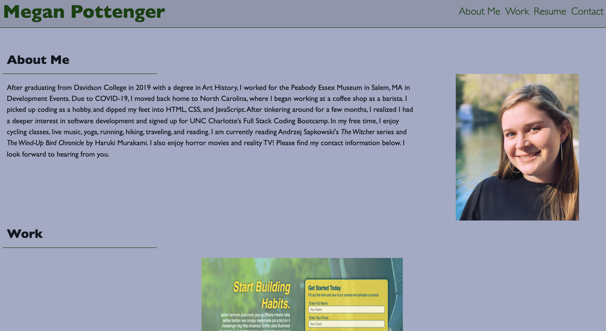

# Advanced CSS Challenge: Professional Portfolio

## Professional Portfolio
In this challenge, we were tasked with creating our own professional portfolio, with the intent to develop and build upon as we increase through the class. This portfolio was built entirely with HTML and CSS, and I used some of the tricks we had learned over the past week. This included using media queries to resize and dynamically adjust the website based on what size screen a viewer might be using when encountering my portfolio. I also used flexboxes to align items in the same container; for example, I did this with the "about-me" section as well as the "work" section, so the viewer may encounter the website in a more interesting way.

## Technologies
I used HTML and CSS in this challenge, and included advanced CSS techniques to make my website more interesting for the viewer.

## Links
Link to my portfolio website: https://mtpott.github.io/portfolio-megan/

Link to my GitHub repository: https://github.com/mtpott/portfolio-megan

## Screenshot

A screenshot of the final project: 